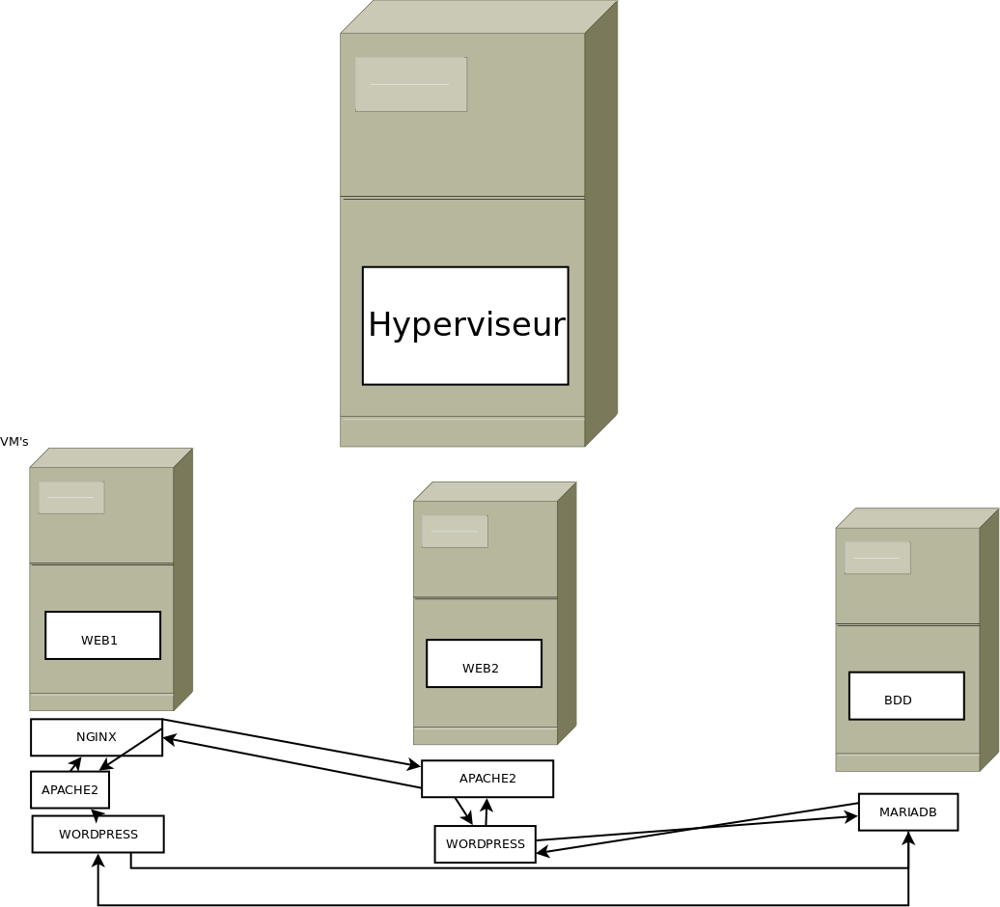
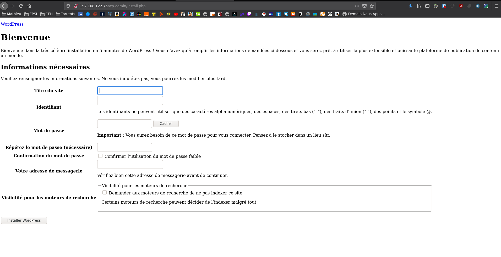
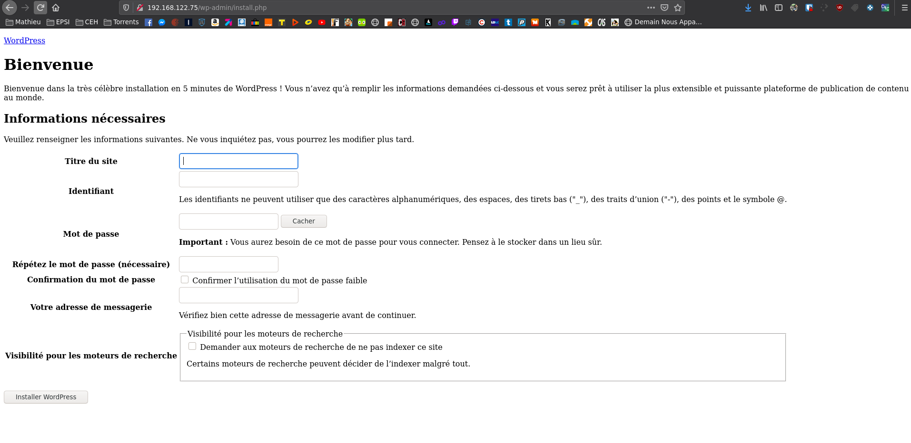
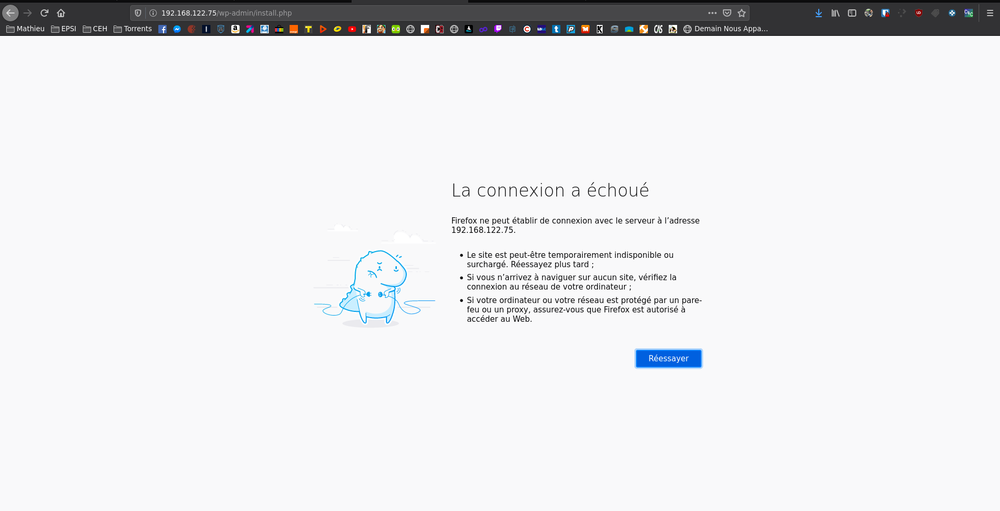

# Déploiement d'un CMS avec ansible


## Sommaire
### Méthodes
### Pre-requis
#### - Machine locale
#### - VM's
### Déploiement

## Méthode

Pour ce projet j'ai choisis, de partir sur l’infrastructure suivante



Il y aura donc un loadbalancer sur WEB1, un serveur apache2 écoutant sur un port différent de 80 et 443 sur WEB1  et WEB2 ainsi que un MariaDB sur BDD. Toute cette infrastructure pour héberger un WORDPRESS Hautement disponible.


## Pre-requis

### Machine locale
Sur la machine locale

- ansible
- paire de clefs ssh
- configurer ansible.cfg pour utiliser python3

```
interpreter_python = /usr/bin/python3
```

### VM's

- Python[2,3] Python[2,3]-apt Python[2,3]-pip Python[2,3]-dev
- Clef publique SSH déposé sur les vm's (authorized key user root)
- Débian 10


## Déploiement

Pour utiliser ce playbook, rien de plus simple.

D'abord il faut cloner ce repo.

```
git clone https://github.com/BedoM/Projet-Management.git
````

une fois le repo cloné, déplacer vous dedans.

Avant de lancer le playbook, modifié le fichier hosts.yml avec les IP de vos VM.

Vous êtes maintenant prêt à exécuter le playbook mais avant ça testons d’abord la communication de notre machine avec les vm's au travers de ansible.

Voici la sortie attendue

```
[mathieu@Y520 ansible-project]$ ansible all -m ping -i hosts.yml --key-file /home/mathieu/.ssh/id_rsa_ansible -u root
[WARNING]: Found both group and host with same name: HYPERVISOR

[WARNING]: Found both group and host with same name: BDD

HYPERVISOR | SUCCESS => {
    "changed": false,
    "ping": "pong"
}
BDD | SUCCESS => {
    "changed": false,
    "ping": "pong"
}
WEB1 | SUCCESS => {
    "changed": false,
    "ping": "pong"
}
LOADBALANCER1 | SUCCESS => {
    "changed": false,
    "ping": "pong"
}
WEB2 | SUCCESS => {
    "changed": false,
    "ping": "pong"
}

```

Lançons le playbook qui va déployer notre stack sur nos VM

```
ansible-playbook -i hosts.yml tasks/main.yml --key-file /home/mathieu/.ssh/id_rsa_ansible -u root
````

Patientez 3-4 minutes

Une fois le playbook terminé

Nous pouvons tester l’accès au site via l'ip de WEB1



Pour tester le loadbalacing je vais stopper le service apache sur web1 et tester l’accès au site

```
systemctl stop apache2
```



l’accès au site fonctionne toujours ! 

Nous pouvons appuyer notre théorie en coupant maintenant le processus sur WEB2

```
systemctl stop apache2
```



oupss plus rien ! On redemarre le service apache sur WEB1

```
systemctl start apache2
```

It's WORK !


Mathieu BEDOS


